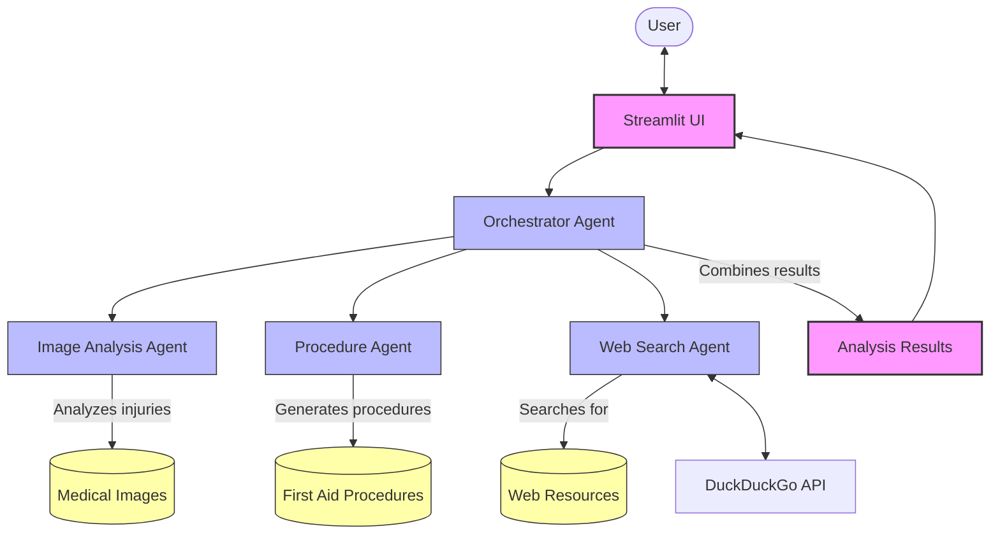

# Virtual First Aid Assistant

## Overview
The Virtual First Aid Assistant is an AI-powered application designed to provide immediate first aid guidance through image analysis, step-by-step procedures, and relevant web resources. Built with Streamlit and powered by OpenRouter's Gemini 2.0 model, this application serves as a virtual first aid consultant for users in Sri Lanka, taking into account local conditions and emergency services.

## Architecture
The application follows a multi-agent architecture to provide comprehensive first aid assistance:



## Features

### 1. Image Analysis
- Analyzes uploaded medical images to identify injuries and conditions
- Provides visual diagnosis based on images
- Suggests immediate interventions

### 2. First Aid Procedures
- Delivers contextual step-by-step first aid procedures
- Adapts recommendations to Sri Lankan context
- Ensures procedures are safe and effective

### 3. Web Resources
- Searches for reliable medical websites and articles
- Provides curated list of relevant web resources
- Includes YouTube videos for visual guidance

### 4. User-Friendly Interface
- Clean, intuitive Streamlit interface
- Easy image upload functionality
- Comprehensive results display

## Setup and Installation

### Prerequisites
- Python 3.8+
- An OpenRouter API key

### Installation Steps
1. Clone the repository
   ```bash
   git clone https://github.com/your-username/first-aid-app.git
   cd first-aid-app
   ```

2. Install dependencies
   ```bash
   pip install -r requirements.txt
   ```

3. Run the application
   ```bash
   streamlit run first-aid.py
   ```

4. Enter your OpenRouter API key in the sidebar

## Usage Guide

1. **Configure API**
   - Enter your OpenRouter API key in the sidebar

2. **Upload Content**
   - Upload medical images related to the injury or condition
   - Describe the problem or symptoms in the text area

3. **Run Analysis**
   - Click "Run Analysis" to process the images and context
   - View the comprehensive results including image analysis, procedures, and web resources

## Technology Stack

- **Frontend**: Streamlit
- **AI Models**: OpenRouter (Gemini 2.0)
- **Libraries**:
  - `agno`: Agent orchestration
  - `pytube`: YouTube integration
  - `DuckDuckGo Tools`: Web search capabilities

## Best Practices

- Upload clear, high-resolution images
- Provide detailed context about the medical issue
- Follow recommended first aid procedures carefully
- Always seek professional medical help for serious conditions

## Project Structure

```
first-aid-app/
├── first-aid.py        # Main application file
├── requirements.txt    # Project dependencies
└── README.md           # Project documentation
```


## Disclaimer

This application is designed to provide first aid guidance only and should not replace professional medical advice or treatment. Always consult healthcare professionals for serious injuries or conditions. 